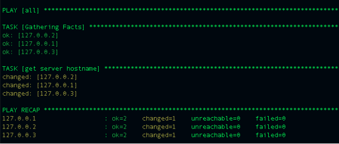

# Ansible Basics

## Whats is Ansible ?

Ansible is an open source *devops* software that helps us to automate :

- Software provisioning
- Application deployment
- Configuration management

By using Ansible we reduce *time* and *risk* of software provisioning and deployment,
make them *as a code* and we can change it and reuse it over and over in future.

## Why do we need Ansible ?

Imagine we own 5 xyz application servers, we make some changes in our `application`
repo but to populate new work we need to sync all servers to our new changes by pulling new code to them
Which one is easier:

- SSH to each server one by one and pull last commit and restart required services ?
- Have all 5 servers as target machine, sending the pull and restart command at
  the same time to all of them by only pushing one button ?

## Ansible Topology

In ansible, we always have two scopes:

1. Control node ( is a machine you run ansible from it )
    - Control nodes should have *Python 2.6 or 2.7* and *can’t be windows machine*
    - Should have *root access* to the node
2. Target machine

## Installation and configuration

### How to install Ansible

Because Ansible is python application it will be available with PIP,
In Linux or MacOS systems we can using following command to install latest version
of Ansible:

- pip install ansible
  or
- easy_install pip

Please take a look at [here](https://docs.ansible.com/ansible/latest/installation_guide/intro_installation.html) for official document about installation

### What is Inventory ?

After installing Ansible, first step to configure our environment is introducing
Target machines to ansible and how to connect to them. Inventory has following features:

- Can be static list of all hosts
- We can group those hosts based on their role or other characteristic
- We can define other configuration like SSH port, password, timeout and user there
- This file doesn't have any file extension

Here is an example of inventory file:

```INI
[xyz-app-servers]
1.1.1.1 ansible_user=user ansible_ssh_pass=password timeout=200 ansible_ssh_private_key_file=path
1.1.1.2 ansible_user=user ansible_ssh_pass=password timeout=200 ansible_ssh_private_key_file=path

[xyz-mongo-servers]
2.2.2.2 ansible_user=user ansible_ssh_pass=password timeout=200 ansible_ssh_private_key_file=path

[xyz-mysql-servers]
3.3.3.3 ansible_user=user ansible_ssh_pass=password timeout=200 ansible_ssh_private_key_file=path
```

### What is `ansible.cfg` file?

We talked about our inventory file but we need to tell Ansible where is that file.
We can do that by using `ansible.cfg` , we need to create that file in root directory
where we installed ansible, your file should look like following:

```INI
[defaults]
inventory = path/to/inventory/file
```

### Test it

Use following commands to make sure your Ansible installation and configuration was successful

```BASH
# To confirm your ansible version use
ansible --version

# To see list of all hosts
ansible --list-hosts all

# To see list of specific group of hosts
ansible --list-hosts xyz-app-servers

# To see list of specific pattern of hosts
ansible --list-hosts xyz-*
```

## PLAYBOOK Introduction

### What is Playbook ?

Playbook is a Yaml file with `.yml` extension and Yaml syntax. inside the playbook
file we find group of ansible roles (group of tasks), name of the hosts these roles are going to run against, grouped by human readable name

> Inside one playbook we can find multiple group of roles
> Playbook starts with opening ---

Here is example of what we see inside a playbook

```YAML
---
- name: Configure stateless instance
  hosts: xyz-app-servers
  sudo: True
  gather_facts: True
  vars:
    migrate_db: "yes"
    ENABLE_ECOMMERCE: false
  roles:
    - role: nginx
    - role: app

```

### What are tasks ?

Tasks are *building block* of ansible. one tasks is one command we wanna run against a server.
Each task is part of specific [module](https://docs.ansible.com/ansible/latest/modules/modules_by_category.html)

each of the following is one task :

```bash
ansible -m ping xyz-app-servers

```

### Playbook execution steps



- First ansible shows us against which hosts its going to run
- In gathering facts it connects by ssh to machines and gather usable information from them
- It run task [human readable name]
- Racap shows us a summary
- For executing playbook you need proper permission on remote machine one `/home/username/.ansible`
- Python should be installed on the remote machine

## Roles

a role is group of related tasks encapsulated in modular way, to be used in
one or multiple playbooks for example:

- app role
- mysql server spin up
- nginx set up

Each role minimum has 3 different folders:

- `defaults` all variables for the role goes here
- `tasks` all main commands to be executed exist here
- `meta` all role dependencies goes here. dependency can be other role that this role depends on

## Ansible syntax

### `become`

Ansible has superuser privilege over target machine but by default for security
reason is not going to use it for each task, we we want to run a task.

`become` can be defined in task level or playbook level, let's see an example:

```
- name: Ensure the httpd service is running
  service:
    name: httpd
    state: started
  become: yes
```

### `become_user`

We can define `become_user` to set to user with desired privileges  , let's see an example:

```
- name: Ensure the httpd service is running
  service:
    name: httpd
    state: started
  become_user: ubuntu
```

### `loop`

For repeating same task for different value we can use `with_items` for example
to create multiple users in our target we can do the following:

```
- name: add several users
  user:
    name: "{{ item }}"
    state: present
    groups: "xyz"
  loop:
     - user1
     - user2
```

### `wait_for`

Is good way to check if specific service is running and waiting on a port.
Also we can use it to `sleep` and `delay` running next tasks for a specific amount of time.

```
- name: Verify Nginx is listening on port 90
  wait_for:
    port: 80
    timeout: 1

- name: Wait for port 8000 to become open on the host, don't start checking for 10 seconds
  wait_for:
    port: 8000
    delay: 10
```

`delay` vs `timeout` : `delay` means number of seconds to wait before start the task but
`timeout` means amount of seconds to wait for something if it fails generate error

### `wait_for_connection`

Waits until remote system is reachable/usable

```
- name: Wait 300 seconds, but only start checking after 60 seconds
  wait_for_connection:
    delay: 60
    timeout: 300
```

### variables

#### How to assign a variable and how to use it

In Yaml syntax for creating variable we should do following

```
Assign a variable:
NAME_OF_THE_VARIABLE: "VALUE_OF_THE_VARIABLE"
APP_BASE: "app-base.xyz.com"

```

Getting the value of variable somewhere in a playbook or a role:

```
APP_SITE_NAME: "{{ APP_BASE }}"
```

#### Variables locations

##### Defaults

As we said during the creation of a role we need to create defaults folder and include
all variables with their default values there

##### in playbook

We can include variables in-file inside our playbook like following

```
---
- name: Configure stateless app instance
  hosts: xyz-app-servers
  sudo: True
  gather_facts: True
  vars:
    migrate_db: "yes"
    ENABLE_ECOMMERCE: false
  roles:
    - role: nginx
    - role: app

```

##### override file

During the execution of playbook in ansible command we can address our override file
to override value of specific variables.

```bash

ansible-playbook playbook.yml -e@vars.yml

```

Level of overrides:

```bash

override file > in-file variables > vars > defaults

```

## Encrypting your configuration files

Because ansible helps us to have our configuration as code, it means we are going to commit
these configuration to a repository and multiple persons are going to have access to your configs.
You configuration can include your critical passwords, like your clouds admin password,
your databases password etc. what we have to do is before committing any code to our repo we have to make
sure we encrypt our configuration file/files and we let ansible know where is the password for those encrypted files.

```bash
# for encrypting
ansible-vault encrypt [filename]

# for decrypting
ansible-vault decrypt [filename]

# during running playbook we need to add following switch
--vault-password-file [path/to/the/password/file]

```

## Troubleshooting

- If you get `/usr/bin/python: not found` it means `python` and `pip` are not installed
in remote target, use following commands to install python and it dependencies.

```bash
sudo apt-get install python-pip python-dev build-essential
```

- for following error : `to use the 'ssh' connection type with passwords, you must install the sshpass program`
install `sshpass` first

```bash
#for macos machines
brew create https://sourceforge.net/projects/sshpass/files/sshpass/1.06/sshpass-1.06.tar.gz --force
brew install sshpass

# for linux machines
sudo apt-get install sshpass
```

## Exercises

### Install Ansible in your control machine

```
# creating new virtual env
virtualenv ansible-test

# installing ansible
First activate your virtual environment and then run
pip install ansible
```

### Setup your ansible

Create inventory file, introduce this file and also path to your roles in config file
You can find example of config file [here](exercises/ansible.cfg)
and example of inventory file [here](exercises/hosts)

### Create roles and run it against target

1. create a folder called `playbooks`
1. inside playbooks create `roles` folder and make sure you defined it's path in `ansible.cfg`
2. create new role called `mysql` by using following command:

- `ansible-galaxy init mysql`

3. go inside `mysql/tasks/main.yml` file and write commands to do the following

```INI
1. Update apt packages to the latest version
2. check if mysql is already installed and if yes, show a message to the user
3. if Mysql is not installed, install mysql in the server
4. after installation, add user called demo with password 123456 to mysql
5. restart mysql service
6. make sure mysql service is back and running
7. define a tag for restarting and starting mysql
```

4. inside `playbooks` create a yaml file called `db_provision.yml`
5. inside `db_provision.yml` define hosts you want to run this playbook for
6. include `mysql` role inside the playbook
7. run the playbook against target hosts
8. run it again with provided tag
